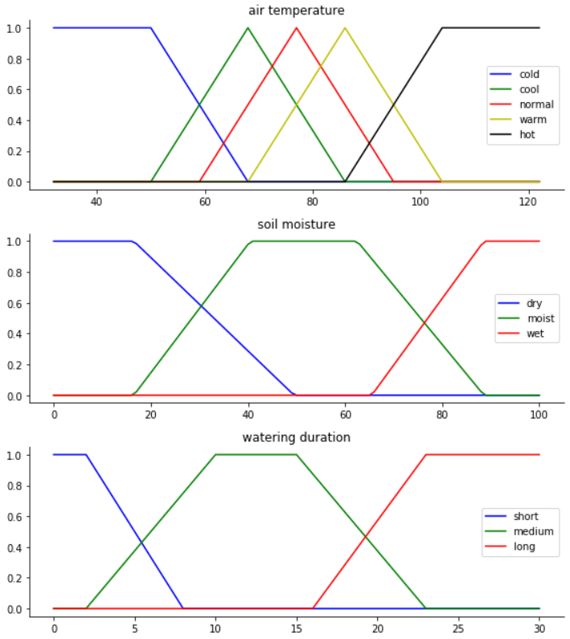
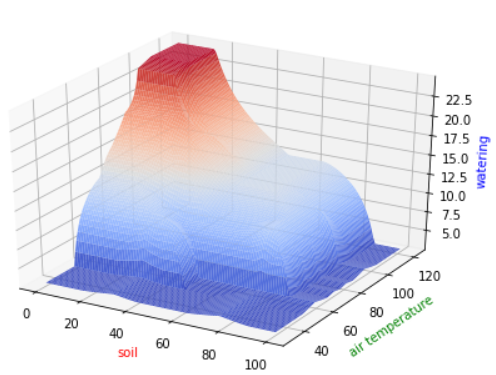
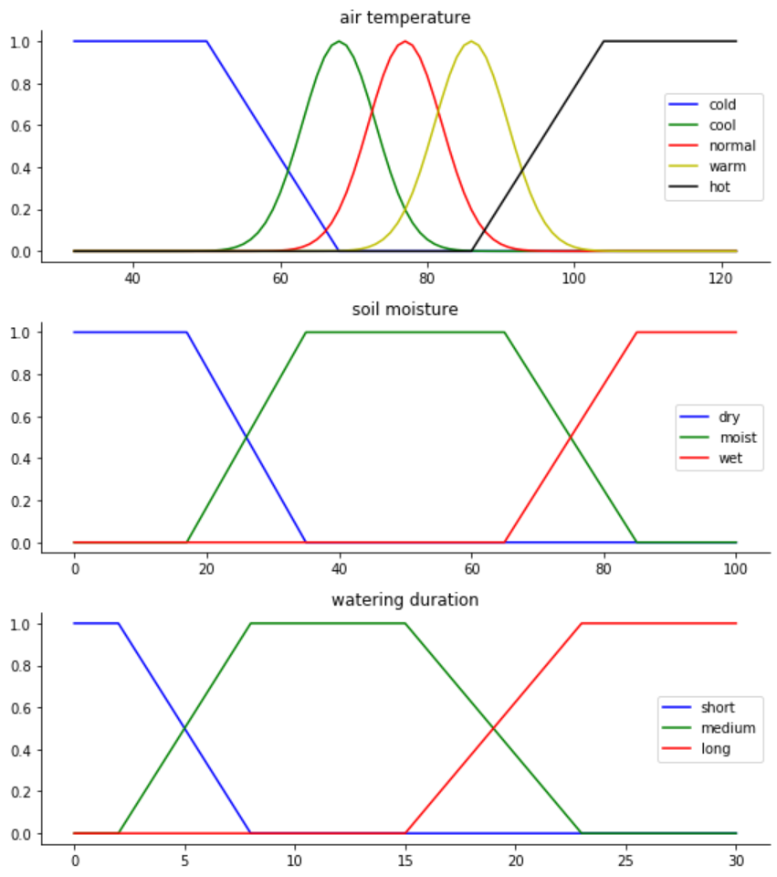
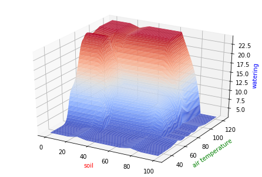

# IC HW2

- [IC HW2](#ic-hw2)
	- [Original setup](#original-setup)
		- [MF Graphs](#mf-graphs)
		- [Look-up table](#look-up-table)
		- [Some extreme value test at universe](#some-extreme-value-test-at-universe)
		- [Some extreme value test at MF](#some-extreme-value-test-at-mf)
		- [Some value test at MF overlaps](#some-value-test-at-mf-overlaps)
		- [Performance surface](#performance-surface)
	- [Revised setup](#revised-setup)
		- [MF Graphs](#mf-graphs-1)
		- [Look-up table](#look-up-table-1)
		- [Some extreme value test at universe](#some-extreme-value-test-at-universe-1)
		- [Some extreme value test at MF](#some-extreme-value-test-at-mf-1)
		- [Some value test at MF overlaps](#some-value-test-at-mf-overlaps-1)
		- [Performance surface](#performance-surface-1)

## Original setup

### MF Graphs

### Look-up table

|           | **cold** | **cool** | **normal** | **warm** | **hot** |
|-----------|----------|----------|------------|----------|---------|
| **dry**   | short    | medium   | medium     | long     | long    |
| **moist** | short    | short    | medium     | medium   | medium  |
| **wet**   | short    | short    | short      | short    | short   |

### Some extreme value test at universe

_At high Moisture, Temp is not important: the Time goes to same value ~2.8_

_At low Temp, Moisture is not important: the Time goes to same value ~2.8_

- Temp: 32℉, Moisture: 0%
	- Time: 2.8000000145037967
- Temp: 32℉, Moisture: 100%
	- Time: 2.8000000145037967
- Temp: 122℉, Moisture: 0%
	- Time: 24.55555552181113
- Temp: 122℉, Moisture: 100%
	- Time: 2.8000000145037967

### Some extreme value test at MF

- Temp: 50℉, Moisture: 17%
	- Time: 2.8110838148969592
- Temp: 50℉, Moisture: 89
	- Time: 2.8000000145037967
- Temp: 95℉, Moisture: 17%
	- Time: 24.107752578903757
- Temp: 95℉, Moisture: 89%
	- Time: 2.8000000145037967

### Some value test at MF overlaps

- Temp: 59℉, Moisture: 31%
	- Time: 10.53174603174603
- Temp: 59℉, Moisture: 76%
	- Time: 3.3292197012277347
- Temp: 104℉, Moisture: 31%
	- Time: 16.92613035839174
- Temp: 104℉, Moisture: 76%
	- Time: 10.685974669564633

### Performance surface

## Revised setup

1. When the temp is hot, the watering time should be long even if the soil is in "moist" state, because the water would evaporate real quick.
   
2. When the tmep is cold, the watering time should remain short in case of cold water freezing the root
   
3. In normal condition, the watering should be long when the soil is dry, since it is better to keep plant hydrated than dry.
   
4. Use Gaussian function to prevent sharp transition in MF.

### MF Graphs

### Look-up table

|           | **cold** | **cool** | **normal** | **warm** | **hot** |
|-----------|----------|----------|------------|----------|---------|
| **dry**   | short    | medium   | long       | long     | long    |
| **moist** | short    | short    | medium     | medium   | long    |
| **wet**   | short    | short    | short      | short    | short   |

### Some extreme value test at universe
_Not much change here. Note that when temp is low, the time remain short to prevent frost bite_

- Temp: 32℉, Moisture: 0%
	- Time: 2.800000014717362
- Temp: 32℉, Moisture: 100%
	- Time: 2.8000000145037967
- Temp: 122℉, Moisture: 0%
	- Time: 24.257575757575754
- Temp: 122℉, Moisture: 100%
	- Time: 2.8000000145037967

### Some extreme value test at MF
_A rather smooth surface compared to the original settings._

- Temp: 50℉, Moisture: 17%
	- Time: 2.858882201730701
- Temp: 50℉, Moisture: 89
	- Time: 2.8000000145037967
- Temp: 95℉, Moisture: 17%
	- Time: 23.44870373869836
- Temp: 95℉, Moisture: 89%
	- Time: 3.307692321564789

### Some value test at MF overlaps
_Time is longer when the temp is high_

- Temp: 59℉, Moisture: 31%
	- Time: 8.788602461059433
- Temp: 59℉, Moisture: 76%
	- Time: 3.3943411935143946
- Temp: 104℉, Moisture: 31%
	- Time: 23.885998339093554
- Temp: 104℉, Moisture: 76%
	- Time: 15.906406488444674

### Performance surface

