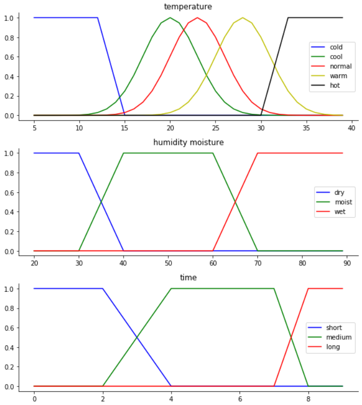
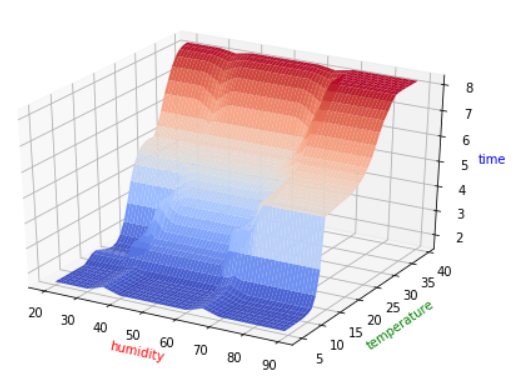
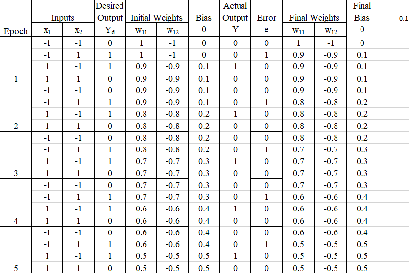
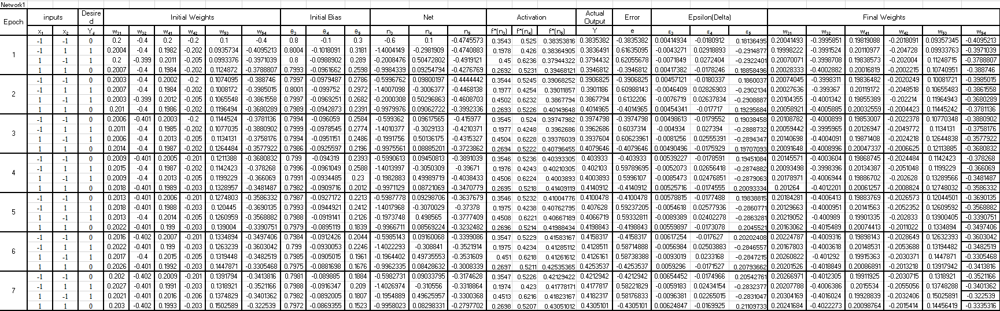
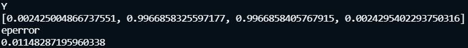
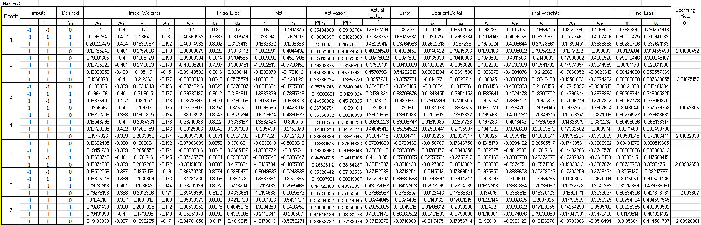
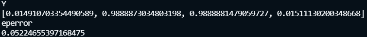

# IC HW3

- [IC HW3](#ic-hw3)
	- [Problem 1](#problem-1)
		- [Setup Rationale](#setup-rationale)
		- [MF Graphs](#mf-graphs)
		- [Look-up table](#look-up-table)
		- [Some extreme value test at universe](#some-extreme-value-test-at-universe)
		- [Some value test at MF overlaps](#some-value-test-at-mf-overlaps)
		- [Performance surface](#performance-surface)
	- [Problem 2-1](#problem-2-1)
	- [Problem 2-2](#problem-2-2)
		

## Problem 1

### Setup Rationale

1. When the temp diff. is large (hot) and the humidity is wet, the running time should be long to dry the air and cool the temperature.
   
2. When the tmep diff. is small (cold) and the humidity is dry, the running time should be short in case of making the air too dry or too cold.
   
3. In normal condition, the running time should be short when the soil is dry, since it is better not to dry the air any further.
   
4. Use Gaussian function to prevent sharp transition in MF.

### MF Graphs

### Look-up table

|           | **cold** | **cool** | **normal** | **warm** | **hot** |
|-----------|----------|----------|------------|----------|---------|
| **dry**   | short    | short    | short      | medium   | long    |
| **moist** | short    | short    | medium     | medium   | long    |
| **wet**   | short    | medium   | medium     | long     | long    |

### Some extreme value test at universe

- Temp: 5℃, Moisture: 20%
	- Time: 1.5555555555566383
- Temp: 5℃, Moisture: 90%
	- Time: 1.5555789505107567
- Temp: 40℃, Moisture: 20%
	- Time: 8.207002164939203
- Temp: 40℃, Moisture: 90%
	- Time: 8.22221376366066

### Some value test at MF overlaps

- Temp: 13℃, Moisture: 35%
	- Time: 1.8010425983522174
- Temp: 13℃, Moisture: 65%
	- Time: 2.3312134077801674
- Temp: 24℃, Moisture: 35%
	- Time: 4.035105519017779
- Temp: 24℃, Moisture: 65%
	- Time: 4.569332349757592

### Performance surface

## Problem 2-1

This network cannot learn XOR problem. It does not converge.

## Problem 2-2

Network 1 can learn XOR problem.

Below is the screenshot of the enclosed Excel file.

It shows to very detail manner, including every weight. We can see the error initially is increasing.

Another Python code train the network to 300000 epoch.

Below is the output from the network, the result is very close to ground truth, so 
we can say this network can learn XOR problem.

Network 2 can learn XOR problem.

Below is the screenshot of the enclosed Excel file.

It shows to very detail manner, including every weight. We can see the error initially is increasing.

Another Python code train the network to 10000 epoch.

Below is the output from the network, the result is very close to ground truth, so 
we can say this network can learn XOR problem.

