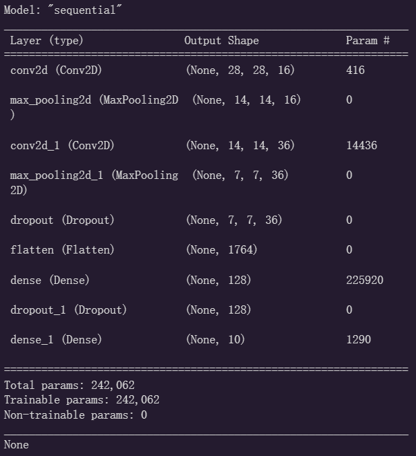
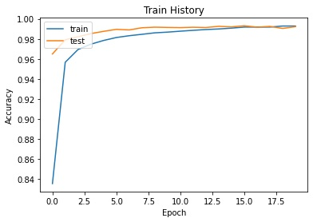
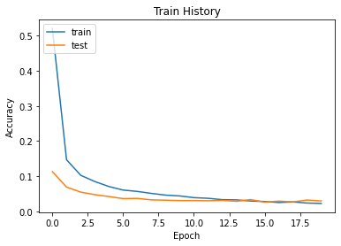
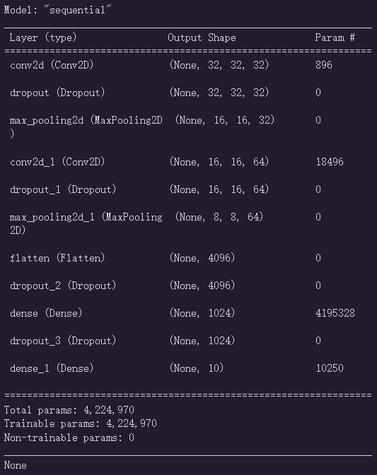
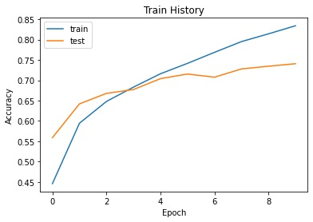
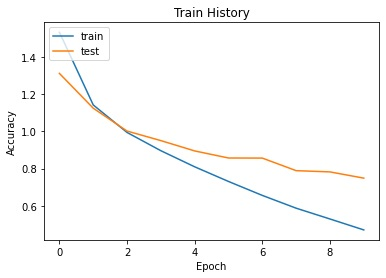

# IC HW5

- [IC HW5](#ic-hw5)
  - [Problem 1](#problem-1)
    - [Original Setup](#original-setup)
      - [Model](#model)
      - [Hyperparameter](#hyperparameter)
      - [Accuracy Train History](#accuracy-train-history)
      - [Loss Train History](#loss-train-history)
      - [Test Accuracy](#test-accuracy)
      - [Confusion Matrix](#confusion-matrix)
    - [Modified Setup](#modified-setup)
      - [Model](#model-1)
      - [Hyperparameter](#hyperparameter-1)
      - [Accuracy Train History](#accuracy-train-history-1)
      - [Loss Train History](#loss-train-history-1)
      - [Test Accuracy](#test-accuracy-1)
      - [Confusion Matrix](#confusion-matrix-1)
  - [Problem 2](#problem-2)
    - [Original Setup](#original-setup-1)
      - [Model](#model-2)
      - [Hyperparameter](#hyperparameter-2)
      - [Accuracy Train History](#accuracy-train-history-2)
      - [Loss Train History](#loss-train-history-2)
      - [Test Accuracy](#test-accuracy-2)
      - [Confusion Matrix](#confusion-matrix-2)
    - [Modified Setup](#modified-setup-1)
      - [Model](#model-3)
      - [Hyperparameter](#hyperparameter-3)
      - [Accuracy Train History](#accuracy-train-history-3)
      - [Loss Train History](#loss-train-history-3)
      - [Test Accuracy](#test-accuracy-3)
      - [Confusion Matrix](#confusion-matrix-3)

## Problem 1

### Original Setup

#### Model

#### Hyperparameter

| **Item** | **Value** |
|-----------|----------|
| **Optimize**   | Adam    |
| **validation_split** | 0.2    |
| **epochs**   | 20    |
| **batch_size**   | 300    |

#### Accuracy Train History

#### Loss Train History

#### Test Accuracy
0.9919999837875366

#### Confusion Matrix

|label|0|1|2|3|4|5|6|7|8|9|
|---|---|---|---|---|---|---|---|---|---|---|
|0|975|0|1|0|0|1|1|1|1|0|
|1|0|1129|0|2|0|0|0|3|1|0|
|2|0|0|1025|0|0|0|0|6|1|0|
|3|0|0|1|1006|0|1|0|0|2|0|
|4|0|0|0|0|980|0|1|0|0|1|
|5|2|0|0|8|0|880|1|0|0|1|
|6|3|2|1|0|2|2|945|0|3|0|
|7|0|1|1|1|0|0|0|1023|1|1|
|8|3|0|2|0|0|0|0|0|968|1|
|9|0|1|1|1|10|4|0|3|2|987|

### Modified Setup

#### Model

#### Hyperparameter

#### Accuracy Train History

#### Loss Train History

#### Test Accuracy

#### Confusion Matrix

## Problem 2

### Original Setup

#### Model

#### Hyperparameter

| **Item** | **Value** |
|-----------|----------|
| **Optimize**   | Adam    |
| **validation_split** | 0.2    |
| **epochs**   | 10    |
| **batch_size**   | 128    |

#### Accuracy Train History

#### Loss Train History

#### Test Accuracy
0.7432000041007996

#### Confusion Matrix

|label|0|1|2|3|4|5|6|7|8|9|
|---|---|---|---|---|---|---|---|---|---|---|
|0|749|14|54|14|10|9|13|8|91|38|
|1|11|848|13|6|4|5|10|2|32|69|
|2|57|3|701|37|86|33|49|16|10|8|
|3|18|9|102|523|81|160|54|20|22|11|
|4|16|3|89|54|742|18|33|32|12|1|
|5|12|1|79|165|65|609|24|36|8|1|
|6|2|4|59|46|36|20|823|1|8|1|
|7|15|3|51|27|70|46|9|766|5|8|
|8|38|17|25|6|10|9|5|1|872|17|
|9|21|71|15|13|6|13|9|13|40|799|

### Modified Setup

#### Model

#### Hyperparameter

#### Accuracy Train History

#### Loss Train History

#### Test Accuracy

#### Confusion Matrix